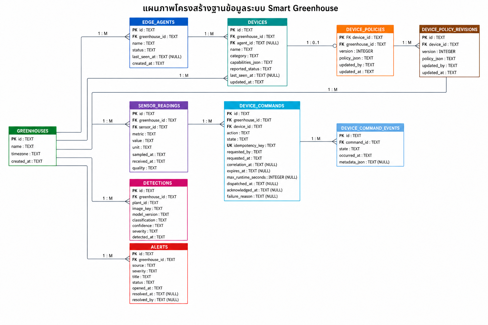
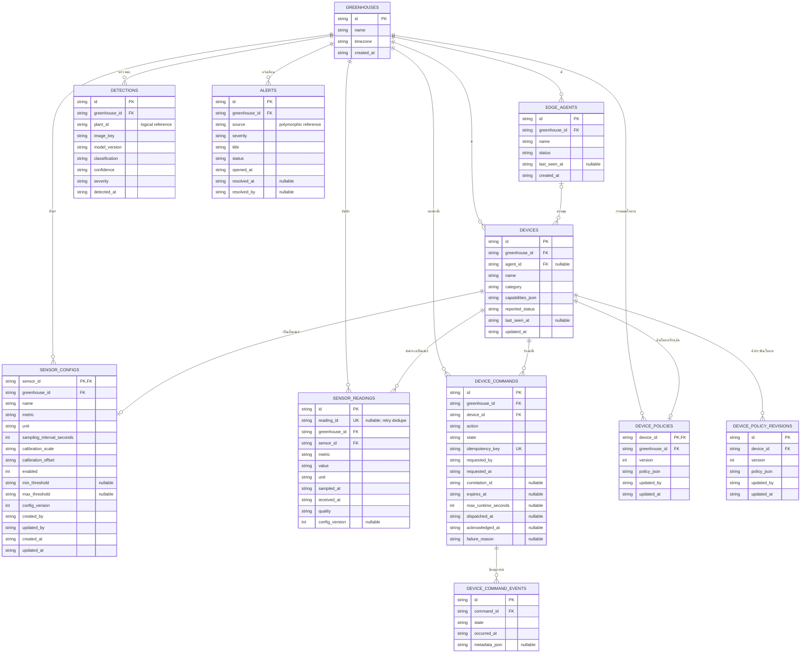

# แผนภาพโครงสร้างฐานข้อมูล (ER Diagram)

แผนภาพนี้อ้างอิง schema ปัจจุบันจาก `db/schema.ts` และ migration ใน `drizzle/` สำหรับฐานข้อมูล Cloudflare D1 (SQLite)

- [เปิดไฟล์ SVG](./database-er-diagram.svg) สำหรับซูมโดยไม่แตก
- Source สำหรับแก้ layout: `database-er-diagram.dot`

## Mermaid source

## ความสัมพันธ์หลัก

- โรงเรือนหนึ่งแห่งมี edge agent, อุปกรณ์, sensor reading, คำสั่ง, detection และ alert ได้หลายรายการ
- edge agent หนึ่งตัวควบคุมอุปกรณ์ได้หลายตัว แต่อุปกรณ์ยังไม่จำเป็นต้องผูก agent (`agent_id` เป็น nullable)
- อุปกรณ์หนึ่งตัวมีนโยบายปัจจุบันได้สูงสุดหนึ่งรายการ และมี revision history ได้หลายรายการ
- คำสั่งอุปกรณ์หนึ่งรายการมี event log ได้หลายรายการ
- `sensor_readings.sensor_id` อ้างถึงอุปกรณ์ประเภทเซ็นเซอร์ใน `devices.id`
- `sensor_configs` เป็น source of truth สำหรับ metric, calibration, sampling, enable state และ threshold ของ sensor channel
- `sensor_readings.reading_id` เป็น stable idempotency key สำหรับ retry จาก edge agent

## ข้อสังเกตจาก schema ปัจจุบัน

- ความสัมพันธ์ทั้งหมดในภาพเป็น **logical foreign keys**; migration ปัจจุบันสร้าง index แต่ยังไม่ได้ประกาศ SQLite `FOREIGN KEY` constraints
- `detections.plant_id` ยังไม่มีตาราง `plants` ให้บังคับความสัมพันธ์
- `alerts.source` เป็น polymorphic text ยังไม่อ้างถึงตารางใดโดยตรง
- `capabilities_json`, `policy_json` และ `metadata_json` เก็บ JSON ในคอลัมน์ `TEXT`
- ข้อมูล demo ฝั่ง browser เช่น zone, crop batch, plant, camera และ sensor configuration ยังอยู่ใน local state/localStorage ไม่ใช่ตาราง D1
