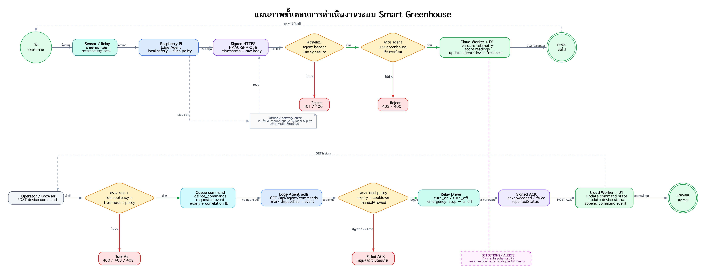

# แผนภาพขั้นตอนการดำเนินงานระบบ Smart Greenhouse

แผนภาพนี้อ้างอิง flow จาก edge-agent, API routes และ D1 schema ใน repo ปัจจุบัน แบ่งเป็น 2 flow:

- telemetry/heartbeat: sensor → Raspberry Pi → signed API → validate → D1
- device command: operator → validate policy → queue → edge poll → relay → ACK → audit

- [เปิดไฟล์ SVG](./operation-workflow-diagram.svg) สำหรับซูม
- [Graphviz source](./operation-workflow-diagram.dot)

หมายเหตุ: ตาราง `detections` และ `alerts` มีใน schema แล้ว แต่ยังไม่มี ingestion route ใน API ปัจจุบัน จึงแสดงเป็นงานถัดไปด้วยเส้นประ
