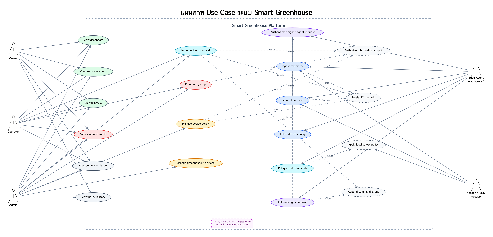

# แผนภาพ Use Case ระบบ Smart Greenhouse

Actors ในระบบ:

- **Viewer** — ดูข้อมูลและประวัติ
- **Operator** — ควบคุมอุปกรณ์และจัดการ alert
- **Admin** — จัดการ policy และโครงสร้าง greenhouse/device
- **Edge Agent** — ส่ง telemetry, heartbeat, รับ command และส่ง ACK
- **Sensor / Relay Hardware** — ให้ค่าที่วัดและทำงานตามคำสั่ง

- [เปิดไฟล์ SVG](./use-case-diagram.svg) สำหรับซูม
- [Graphviz source](./use-case-diagram.dot)

หมายเหตุ: `detections` และ `alerts` มีตารางใน schema แล้ว แต่ ingestion API ยังไม่อยู่ใน implementation ปัจจุบัน
